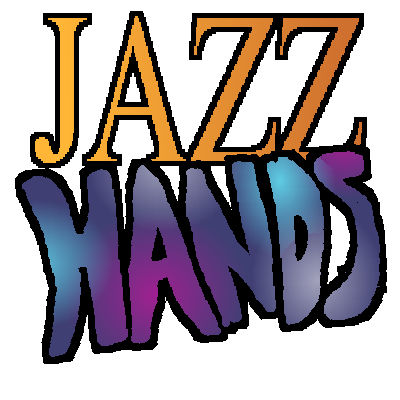

# jazzhands
JazzHands is a mixed-reality, retro-style rhythm game developed using GameMakerStudio2 & Python3.12. The game involves repeating hand gestures shown on the screen, in rhythm with a choice of 3 custom-edited songs to earn points:
* Michael Jackson Thriller (8bit Rendition)
* Rasputin (8bit Rendition)
* Tetris Theme Song (8bit Rendition)

# Backend
JazzHands uses MediaPipe to recognize hand gestures. Jazzhands can distinguish left hands from right hands, and successfully handle multiple hands, allowing for single and multiplayer mode.

# Frontend
Assets are made in Aesprite. JazzHands was made with a retro feel in mind, hoping to combine the nostalgic feel of arcade games with cutting-edge computer vision technology. We tailored our design decisions to portray this idea.

# Redevelopment & Continuing Works
Jazzhands is currently under a massive redevelopment. Aiming for 2024 release.